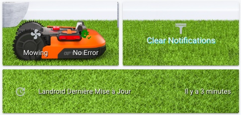
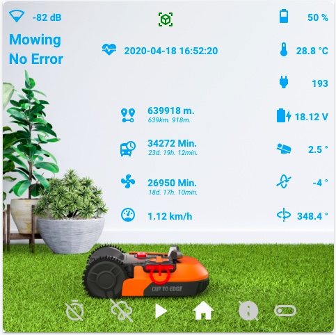
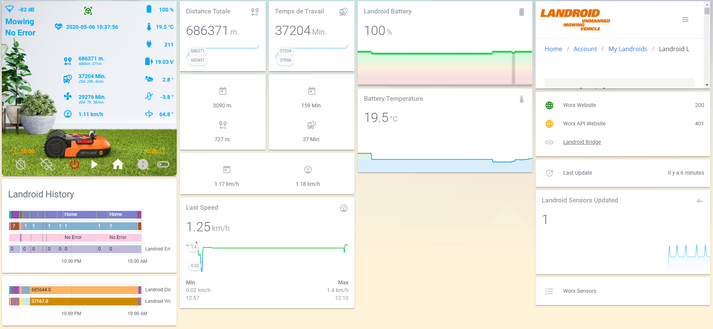
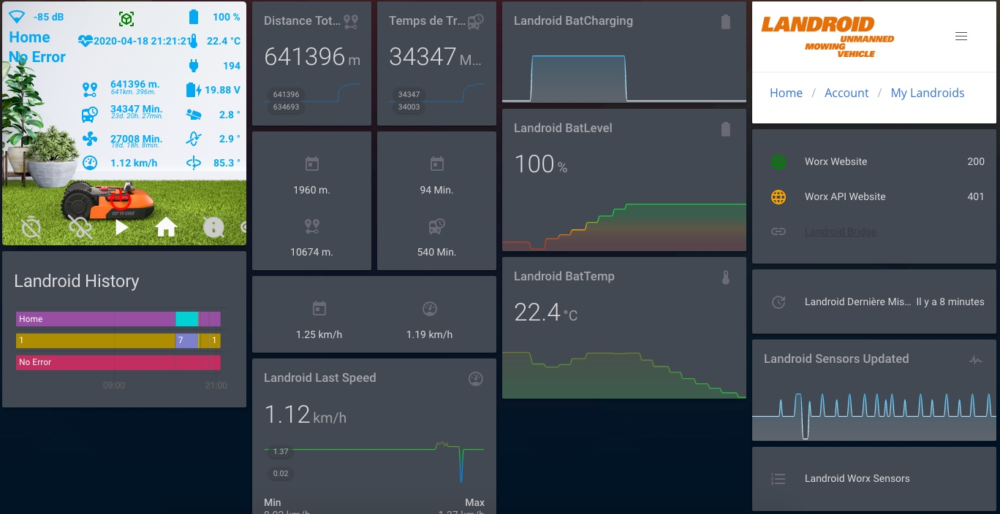

# HomeAssistant-Landroid
Stuff to monitor my Worx Landroid L WR155E in Home Assistant

  

## Quick help:
- Copy the content of worx_landroid_sensors.yaml to your sensors file or to your configuration.yaml.
   - In the worx_token REST sensor, fill \<YOUR WORX EMAIL\> and \<YOUR WORX PASSWORD\> with your Worx credentials,
   - In the worx_sensors REST sensor, fill \<YOUR LANDROID SN\> with your Worx mower serial.
- Check your conf, restart the server.
- Copy the content of *{{ states.sensor.worx_token.attributes.access_token }}* to your secret.yaml (with "Bearer " at the beginning): worxtoken: "Bearer eyJ0eXAiOiJK...................."
- Check your conf, restart the server.
- UI Big card: Create a new card in your UI, paste the content of hacards/hacard.yaml.
- UI Small card: Create a new card in your UI, paste the content of hacards/hacard_home.yaml.
- Create the subfolder "mower" in your www folder, copy files from www/mower to your www/mower.
- Adapt: remove ACS, etc.
 
 Et voilà !  
 
 
 
*To be done, when I'll have time:*
- *Find how to use the content of sensor.worx_token in the sensor.worx_sensors "Authorization:"*
- *Find how to use the Worx credentials from the secret file in the sensor.worx_sensors "payload:"*
- *To try again to push actions to the mower: start, home... and to confirm my automation: Rain detected -> Back to Home -> RainDelay  
(I was banned since one month by AWS, created a new Worx account, seems ok now).*
- *Improvements...*

*Helped by:*
* *https://github.com/virtualzone/landroid-bridge*
* *https://github.com/Barma-lej/halandroid*

https://www.home-assistant.io

Info:
I'm doing this after my work, my family life... so between midnight and 2AM...
